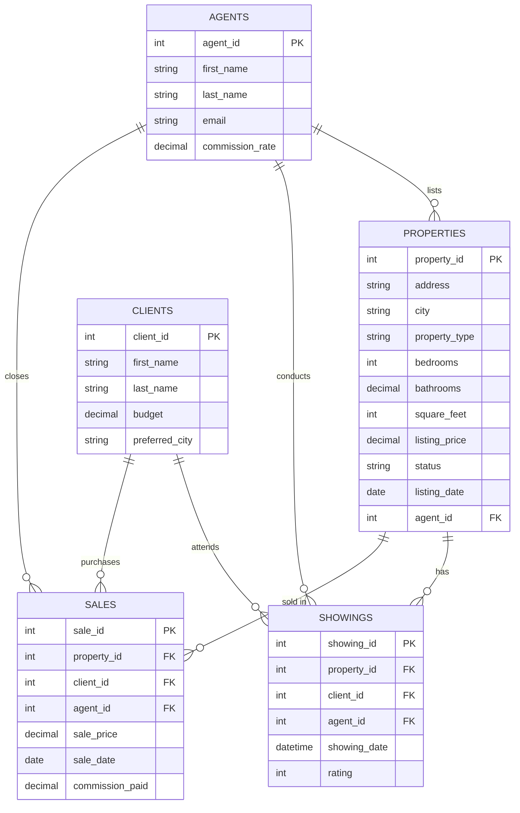

# Real Estate SQL Tutorial: 15 Practice Problems

## Table of Contents
1. [Database Schema Overview](#database-schema-overview)
2. [Sample Data](#sample-data)
3. [SQL Problems & Solutions](#sql-problems--solutions)

---

## Database Schema Overview

Our real estate database consists of 5 main tables:

```sql
-- Properties Table
CREATE TABLE properties (
    property_id INT PRIMARY KEY,
    address VARCHAR(200),
    city VARCHAR(100),
    state VARCHAR(50),
    zip_code VARCHAR(10),
    property_type VARCHAR(50), -- 'House', 'Condo', 'Apartment', 'Townhouse'
    bedrooms INT,
    bathrooms DECIMAL(3,1),
    square_feet INT,
    lot_size DECIMAL(10,2),
    year_built INT,
    listing_price DECIMAL(12,2),
    status VARCHAR(20), -- 'Available', 'Pending', 'Sold'
    listing_date DATE,
    agent_id INT
);

-- Agents Table
CREATE TABLE agents (
    agent_id INT PRIMARY KEY,
    first_name VARCHAR(50),
    last_name VARCHAR(50),
    email VARCHAR(100),
    phone VARCHAR(20),
    hire_date DATE,
    commission_rate DECIMAL(4,2) -- e.g., 0.03 for 3%
);

-- Clients Table
CREATE TABLE clients (
    client_id INT PRIMARY KEY,
    first_name VARCHAR(50),
    last_name VARCHAR(50),
    email VARCHAR(100),
    phone VARCHAR(20),
    budget DECIMAL(12,2),
    preferred_city VARCHAR(100)
);

-- Showings Table
CREATE TABLE showings (
    showing_id INT PRIMARY KEY,
    property_id INT,
    client_id INT,
    agent_id INT,
    showing_date DATETIME,
    feedback VARCHAR(500),
    rating INT, -- 1-5 scale
    FOREIGN KEY (property_id) REFERENCES properties(property_id),
    FOREIGN KEY (client_id) REFERENCES clients(client_id),
    FOREIGN KEY (agent_id) REFERENCES agents(agent_id)
);

-- Sales Table
CREATE TABLE sales (
    sale_id INT PRIMARY KEY,
    property_id INT,
    client_id INT,
    agent_id INT,
    sale_price DECIMAL(12,2),
    sale_date DATE,
    commission_paid DECIMAL(12,2),
    FOREIGN KEY (property_id) REFERENCES properties(property_id),
    FOREIGN KEY (client_id) REFERENCES clients(client_id),
    FOREIGN KEY (agent_id) REFERENCES agents(agent_id)
);
```

### Entity Relationship Diagram



---

## Sample Data

```sql
-- Insert Agents
INSERT INTO agents VALUES
(1, 'Sarah', 'Johnson', 'sarah.j@realty.com', '555-0101', '2020-01-15', 0.03),
(2, 'Michael', 'Chen', 'michael.c@realty.com', '555-0102', '2019-06-20', 0.035),
(3, 'Emily', 'Rodriguez', 'emily.r@realty.com', '555-0103', '2021-03-10', 0.03),
(4, 'David', 'Kim', 'david.k@realty.com', '555-0104', '2018-11-05', 0.04),
(5, 'Jessica', 'Taylor', 'jessica.t@realty.com', '555-0105', '2022-02-01', 0.03);

-- Insert Properties
INSERT INTO properties VALUES
(101, '123 Oak Street', 'Austin', 'TX', '78701', 'House', 3, 2.0, 1800, 0.25, 2015, 450000, 'Available', '2025-11-01', 1),
(102, '456 Maple Ave', 'Austin', 'TX', '78702', 'Condo', 2, 2.0, 1200, 0, 2018, 320000, 'Sold', '2025-10-15', 2),
(103, '789 Pine Road', 'Houston', 'TX', '77001', 'House', 4, 3.0, 2500, 0.50, 2010, 550000, 'Available', '2025-11-10', 1),
(104, '321 Elm Street', 'Dallas', 'TX', '75201', 'Townhouse', 3, 2.5, 1600, 0.10, 2020, 380000, 'Pending', '2025-11-05', 3),
(105, '654 Cedar Lane', 'Austin', 'TX', '78703', 'House', 5, 4.0, 3200, 0.75, 2022, 750000, 'Available', '2025-10-20', 2),
(106, '987 Birch Court', 'Houston', 'TX', '77002', 'Apartment', 2, 1.0, 900, 0, 2019, 210000, 'Sold', '2025-10-01', 4),
(107, '147 Willow Way', 'Dallas', 'TX', '75202', 'House', 4, 3.5, 2800, 0.60, 2016, 620000, 'Available', '2025-11-15', 3),
(108, '258 Spruce Dr', 'Austin', 'TX', '78704', 'Condo', 1, 1.0, 750, 0, 2021, 180000, 'Available', '2025-11-12', 5),
(109, '369 Ash Blvd', 'Houston', 'TX', '77003', 'House', 3, 2.0, 1900, 0.30, 2014, 425000, 'Sold', '2025-09-20', 1),
(110, '741 Poplar St', 'Dallas', 'TX', '75203', 'Townhouse', 2, 1.5, 1300, 0.08, 2019, 295000, 'Available', '2025-11-08', 4);

-- Insert Clients
INSERT INTO clients VALUES
(201, 'Robert', 'Anderson', 'robert.a@email.com', '555-1001', 500000, 'Austin'),
(202, 'Jennifer', 'Martinez', 'jennifer.m@email.com', '555-1002', 350000, 'Houston'),
(203, 'William', 'Garcia', 'william.g@email.com', '555-1003', 650000, 'Dallas'),
(204, 'Lisa', 'Brown', 'lisa.b@email.com', '555-1004', 250000, 'Austin'),
(205, 'James', 'Wilson', 'james.w@email.com', '555-1005', 800000, 'Austin'),
(206, 'Mary', 'Lee', 'mary.l@email.com', '555-1006', 300000, 'Houston'),
(207, 'John', 'Davis', 'john.d@email.com', '555-1007', 400000, 'Dallas');

-- Insert Showings
INSERT INTO showings VALUES
(301, 101, 201, 1, '2025-11-15 10:00:00', 'Loved the kitchen and backyard', 5),
(302, 102, 202, 2, '2025-10-20 14:00:00', 'Perfect size, great location', 5),
(303, 103, 203, 1, '2025-11-18 11:00:00', 'Too far from downtown', 3),
(304, 104, 201, 3, '2025-11-12 15:00:00', 'Nice but prefer single family', 4),
(305, 105, 205, 2, '2025-11-01 13:00:00', 'Exactly what we wanted!', 5),
(306, 106, 204, 4, '2025-10-05 16:00:00', 'Good starter home', 4),
(307, 107, 203, 3, '2025-11-20 10:30:00', 'Beautiful property', 5),
(308, 108, 204, 5, '2025-11-14 12:00:00', 'Too small for our needs', 2),
(309, 109, 202, 1, '2025-09-25 14:30:00', 'Great neighborhood', 4),
(310, 101, 205, 1, '2025-11-16 09:00:00', 'Considering as backup option', 4);

-- Insert Sales
INSERT INTO sales VALUES
(401, 102, 202, 2, 315000, '2025-10-25', 11025),
(402, 106, 204, 4, 210000, '2025-10-10', 8400),
(403, 109, 202, 1, 420000, '2025-09-30', 12600);
```

---

## SQL Problems & Solutions

### Problem 1: Basic SELECT - List All Available Properties
**Difficulty:** ⭐ Beginner

**Question:** Retrieve all properties that are currently available for sale. Show the address, city, property type, bedrooms, bathrooms, and listing price.

**Concepts Covered:**
- Basic SELECT statement
- WHERE clause
- Column selection

**Solution:**
```sql
SELECT 
    address,
    city,
    property_type,
    bedrooms,
    bathrooms,
    listing_price
FROM properties
WHERE status = 'Available';
```

**Expected Output:**
| address | city | property_type | bedrooms | bathrooms | listing_price |
|---------|------|---------------|----------|-----------|---------------|
| 123 Oak Street | Austin | House | 3 | 2.0 | 450000 |
| 789 Pine Road | Houston | House | 4 | 3.0 | 550000 |
| ... | ... | ... | ... | ... | ... |

**Why This Matters:** This is the foundation of SQL querying. In real estate, agents need to quickly filter available inventory to show clients.

---

### Problem 2: Filtering with Multiple Conditions
**Difficulty:** ⭐ Beginner

**Question:** Find all houses in Austin with at least 3 bedrooms and priced under $500,000.

**Concepts Covered:**
- Multiple WHERE conditions
- AND operator
- Comparison operators

**Solution:**
```sql
SELECT 
    address,
    bedrooms,
    bathrooms,
    listing_price
FROM properties
WHERE city = 'Austin'
    AND property_type = 'House'
    AND bedrooms >= 3
    AND listing_price < 500000;
```

**Why This Matters:** Clients have specific criteria. This query helps match properties to buyer requirements efficiently.

---

### Problem 3: Sorting Results
**Difficulty:** ⭐ Beginner

**Question:** List all properties ordered by listing price from highest to lowest. Show address, city, and listing price.

**Concepts Covered:**
- ORDER BY clause
- DESC keyword

**Solution:**
```sql
SELECT 
    address,
    city,
    listing_price
FROM properties
ORDER BY listing_price DESC;
```

**Why This Matters:** Sorting helps agents present properties in a logical order, whether by price, size, or date listed.

---

### Problem 4: Aggregate Functions - COUNT
**Difficulty:** ⭐⭐ Intermediate

**Question:** How many properties are currently available in each city?

**Concepts Covered:**
- COUNT() function
- GROUP BY clause
- Aggregate functions

**Solution:**
```sql
SELECT 
    city,
    COUNT(*) AS available_properties
FROM properties
WHERE status = 'Available'
GROUP BY city
ORDER BY available_properties DESC;
```

**Expected Output:**
| city | available_properties |
|------|---------------------|
| Austin | 4 |
| Dallas | 2 |
| Houston | 1 |

**Why This Matters:** Understanding inventory distribution helps agencies allocate resources and identify market opportunities.

---

### Problem 5: Average Price Analysis
**Difficulty:** ⭐⭐ Intermediate

**Question:** Calculate the average listing price for each property type. Round to 2 decimal places.

**Concepts Covered:**
- AVG() function
- ROUND() function
- GROUP BY with aggregates

**Solution:**
```sql
SELECT 
    property_type,
    ROUND(AVG(listing_price), 2) AS avg_price,
    COUNT(*) AS property_count
FROM properties
GROUP BY property_type
ORDER BY avg_price DESC;
```

**Why This Matters:** Market analysis requires understanding pricing trends by property type to advise clients on fair market value.

---

### Problem 6: JOIN - Properties with Agent Information
**Difficulty:** ⭐⭐ Intermediate

**Question:** List all available properties along with their listing agent's name and contact information.

**Concepts Covered:**
- INNER JOIN
- Combining data from multiple tables
- Column aliasing

**Solution:**
```sql
SELECT 
    p.address,
    p.city,
    p.listing_price,
    CONCAT(a.first_name, ' ', a.last_name) AS agent_name,
    a.email,
    a.phone
FROM properties p
INNER JOIN agents a ON p.agent_id = a.agent_id
WHERE p.status = 'Available'
ORDER BY p.listing_price DESC;
```

**Why This Matters:** Clients need to contact agents about properties. This query provides complete information in one result set.

---

### Problem 7: Subquery - Properties Above Average Price
**Difficulty:** ⭐⭐ Intermediate

**Question:** Find all properties priced above the average listing price. Show address, city, listing price, and how much above average.

**Concepts Covered:**
- Subqueries
- Calculated columns
- Comparison with aggregate results

**Solution:**
```sql
SELECT 
    address,
    city,
    listing_price,
    ROUND(listing_price - (SELECT AVG(listing_price) FROM properties), 2) AS above_average
FROM properties
WHERE listing_price > (SELECT AVG(listing_price) FROM properties)
ORDER BY above_average DESC;
```

**Why This Matters:** Identifying premium properties helps target high-end buyers and understand luxury market segments.

---

### Problem 8: Agent Performance - Total Sales
**Difficulty:** ⭐⭐⭐ Advanced

**Question:** Calculate each agent's total sales volume, number of sales, and total commission earned. Order by total sales volume.

**Concepts Covered:**
- Multiple aggregate functions
- JOIN operations
- GROUP BY with multiple calculations

**Solution:**
```sql
SELECT 
    CONCAT(a.first_name, ' ', a.last_name) AS agent_name,
    COUNT(s.sale_id) AS total_sales,
    SUM(s.sale_price) AS total_volume,
    SUM(s.commission_paid) AS total_commission
FROM agents a
LEFT JOIN sales s ON a.agent_id = s.agent_id
GROUP BY a.agent_id, a.first_name, a.last_name
ORDER BY total_volume DESC;
```

**Expected Output:**
| agent_name | total_sales | total_volume | total_commission |
|------------|-------------|--------------|------------------|
| Jennifer Martinez | 2 | 735000 | 23625 |
| Michael Chen | 1 | 315000 | 11025 |
| ... | ... | ... | ... |

**Why This Matters:** Performance metrics are crucial for agent evaluation, compensation, and identifying top performers.

---

### Problem 9: Client Matching - Budget Analysis
**Difficulty:** ⭐⭐⭐ Advanced

**Question:** For each client, show how many available properties match their budget and preferred city.

**Concepts Covered:**
- Complex JOIN conditions
- Multiple WHERE criteria
- COUNT with conditions

**Solution:**
```sql
SELECT 
    CONCAT(c.first_name, ' ', c.last_name) AS client_name,
    c.budget,
    c.preferred_city,
    COUNT(p.property_id) AS matching_properties
FROM clients c
LEFT JOIN properties p ON p.city = c.preferred_city
    AND p.listing_price <= c.budget
    AND p.status = 'Available'
GROUP BY c.client_id, c.first_name, c.last_name, c.budget, c.preferred_city
ORDER BY matching_properties DESC;
```

**Why This Matters:** Quickly matching clients to suitable properties improves customer service and increases closing rates.

---

### Problem 10: Showing Conversion Rate
**Difficulty:** ⭐⭐⭐ Advanced

**Question:** Calculate the conversion rate (showings to sales) for each property that has been sold.

**Concepts Covered:**
- Multiple JOINs
- Subqueries
- Division and percentage calculations

**Solution:**
```sql
SELECT 
    p.address,
    p.city,
    s.sale_price,
    (SELECT COUNT(*) FROM showings sh WHERE sh.property_id = p.property_id) AS total_showings,
    ROUND(1.0 / (SELECT COUNT(*) FROM showings sh WHERE sh.property_id = p.property_id) * 100, 2) AS conversion_rate_percent
FROM properties p
INNER JOIN sales s ON p.property_id = s.property_id
WHERE p.status = 'Sold'
ORDER BY conversion_rate_percent DESC;
```

**Why This Matters:** Understanding conversion rates helps optimize marketing strategies and identify what makes properties sell quickly.

---

### Problem 11: Date Functions - Days on Market
**Difficulty:** ⭐⭐ Intermediate

**Question:** For sold properties, calculate how many days they were on the market before selling.

**Concepts Covered:**
- Date arithmetic
- DATEDIFF function
- JOIN operations

**Solution:**
```sql
SELECT 
    p.address,
    p.city,
    p.listing_date,
    s.sale_date,
    DATEDIFF(day, p.listing_date, s.sale_date) AS days_on_market,
    s.sale_price
FROM properties p
INNER JOIN sales s ON p.property_id = s.property_id
WHERE p.status = 'Sold'
ORDER BY days_on_market;
```

**Why This Matters:** Days on market is a key metric for pricing strategy and market health assessment.

---

### Problem 12: Window Functions - Ranking Properties
**Difficulty:** ⭐⭐⭐ Advanced

**Question:** Rank properties within each city by listing price, showing the top 3 most expensive in each city.

**Concepts Covered:**
- RANK() window function
- PARTITION BY
- CTE (Common Table Expression)

**Solution:**
```sql
WITH RankedProperties AS (
    SELECT 
        address,
        city,
        property_type,
        listing_price,
        RANK() OVER (PARTITION BY city ORDER BY listing_price DESC) AS price_rank
    FROM properties
    WHERE status = 'Available'
)
SELECT 
    city,
    address,
    property_type,
    listing_price,
    price_rank
FROM RankedProperties
WHERE price_rank <= 3
ORDER BY city, price_rank;
```

**Why This Matters:** Ranking helps identify premium inventory and compare properties within specific markets.

---

### Problem 13: Complex Aggregation - Agent Efficiency
**Difficulty:** ⭐⭐⭐ Advanced

**Question:** Calculate each agent's average showing rating and identify agents with average ratings above 4.0 who have conducted at least 2 showings.

**Concepts Covered:**
- AVG with JOIN
- HAVING clause
- Filtering aggregated results

**Solution:**
```sql
SELECT 
    CONCAT(a.first_name, ' ', a.last_name) AS agent_name,
    COUNT(sh.showing_id) AS total_showings,
    ROUND(AVG(sh.rating), 2) AS avg_rating,
    COUNT(DISTINCT sh.property_id) AS properties_shown
FROM agents a
INNER JOIN showings sh ON a.agent_id = sh.agent_id
GROUP BY a.agent_id, a.first_name, a.last_name
HAVING COUNT(sh.showing_id) >= 2 AND AVG(sh.rating) > 4.0
ORDER BY avg_rating DESC;
```

**Why This Matters:** Client satisfaction (measured by ratings) is crucial for agent performance evaluation and customer retention.

---

### Problem 14: Price Per Square Foot Analysis
**Difficulty:** ⭐⭐ Intermediate

**Question:** Calculate the price per square foot for all properties and identify which ones are below the average price per square foot for their property type.

**Concepts Covered:**
- Calculated columns
- Subqueries with correlation
- ROUND function

**Solution:**
```sql
SELECT 
    p.address,
    p.city,
    p.property_type,
    p.listing_price,
    p.square_feet,
    ROUND(p.listing_price / p.square_feet, 2) AS price_per_sqft,
    ROUND((SELECT AVG(listing_price / square_feet) 
           FROM properties 
           WHERE property_type = p.property_type), 2) AS avg_price_per_sqft_type
FROM properties p
WHERE p.listing_price / p.square_feet < 
    (SELECT AVG(listing_price / square_feet) 
     FROM properties 
     WHERE property_type = p.property_type)
ORDER BY price_per_sqft;
```

**Why This Matters:** Price per square foot is a standard metric for comparing property values and identifying good deals.

---

### Problem 15: Comprehensive Report - Top Performing Agent
**Difficulty:** ⭐⭐⭐⭐ Expert

**Question:** Create a comprehensive report showing the top-performing agent based on total commission, including their active listings, completed sales, and average showing rating.

**Concepts Covered:**
- Multiple JOINs
- Subqueries
- Complex aggregations
- COALESCE for NULL handling

**Solution:**
```sql
WITH AgentStats AS (
    SELECT 
        a.agent_id,
        CONCAT(a.first_name, ' ', a.last_name) AS agent_name,
        a.email,
        a.commission_rate,
        COALESCE(SUM(s.commission_paid), 0) AS total_commission,
        COUNT(DISTINCT s.sale_id) AS total_sales,
        COUNT(DISTINCT CASE WHEN p.status = 'Available' THEN p.property_id END) AS active_listings,
        ROUND(AVG(sh.rating), 2) AS avg_showing_rating,
        COUNT(DISTINCT sh.showing_id) AS total_showings
    FROM agents a
    LEFT JOIN sales s ON a.agent_id = s.agent_id
    LEFT JOIN properties p ON a.agent_id = p.agent_id
    LEFT JOIN showings sh ON a.agent_id = sh.agent_id
    GROUP BY a.agent_id, a.first_name, a.last_name, a.email, a.commission_rate
)
SELECT 
    agent_name,
    email,
    total_commission,
    total_sales,
    active_listings,
    total_showings,
    avg_showing_rating,
    ROUND(commission_rate * 100, 1) AS commission_rate_percent
FROM AgentStats
ORDER BY total_commission DESC
LIMIT 1;
```

**Expected Output:**
| agent_name | email | total_commission | total_sales | active_listings | total_showings | avg_showing_rating | commission_rate_percent |
|------------|-------|------------------|-------------|-----------------|----------------|-------------------|------------------------|
| Michael Chen | michael.c@realty.com | 11025 | 1 | 2 | 2 | 5.00 | 3.5 |

**Why This Matters:** Comprehensive performance reports help management make informed decisions about bonuses, promotions, and resource allocation.

---

## Practice Tips

1. **Start Simple:** Begin with Problems 1-3 to build confidence with basic queries
2. **Understand JOINs:** Problems 6-9 focus on combining data - this is crucial for real-world scenarios
3. **Master Aggregations:** Problems 4-5 and 8-9 teach you to summarize data effectively
4. **Learn Window Functions:** Problem 12 introduces powerful analytical capabilities
5. **Build Complex Queries:** Problems 14-15 combine multiple concepts - tackle these last

## Next Steps

After completing these problems:
- Try modifying queries to answer related questions
- Practice writing queries without looking at solutions
- Create your own sample data and write custom queries
- Learn about query optimization and indexes
- Explore database-specific features (PostgreSQL, MySQL, SQL Server)

## Additional Resources

- **SQL Style Guide:** Use consistent formatting and naming conventions
- **Performance:** Learn about EXPLAIN plans to optimize queries
- **Transactions:** Understand ACID properties for data integrity
- **Stored Procedures:** Encapsulate complex logic for reuse

---

**Good luck with your SQL learning journey! 🚀**
